----
# Country Lookup Example
This example demonstrates a privacy preserving search against an encrypted 
database and it is implemented using the [Brakerski-Gentry-Vaikuntanathan][1] 
(BGV) scheme. The database is a key-value store pre-populated with the 
English names of countries and their capital cities from the continent of 
Europe. Selecting the country will use HElib to perform a search of the 
matching capital.

## Relation to a real use case
Privacy preserving search is a common scenario to demonstrate the benefits of
homomorphic encryption. Being able to perform a query while preserving the
privacy and confidentiality of the parameters of the query has many
applications across various industry segments spanning from genomics to
finance. This example uses a simple and easy to follow algorithm that
demonstrates how one can use homomorphic encryption based techniques to
generate a mask to retrieve data from a key-value pair database. It uses a
dataset that is understandable for users across all industries and expertise
levels. 

With respect to realism of data, the dataset takes into account all countries
in the continent of Europe. In a real use case, this could be information on
customers or financial records for example. This is an educational example so a
small dataset was needed to ensure timely responses and that it was relevant
for all users.

## Walk-through of How This Example Works
Here we present a detailed description of the algorithm used to performed a
privacy preserving database lookup. This simple algorith also demonstrates
many of the basic constructs utilized in more comples homomorphic encryption
based applications.

Before we begin, we note the boxes shown in the images below represent
plaintexts/ciphertexts. The values inside the boxes are shown purely for
illustrative purposes to ease in the explanation and in reality cannot be
viewed unless decrypted.

Starting with the database, we have a key-value store `k,v` as shown below,
where the keys `k` are unique.

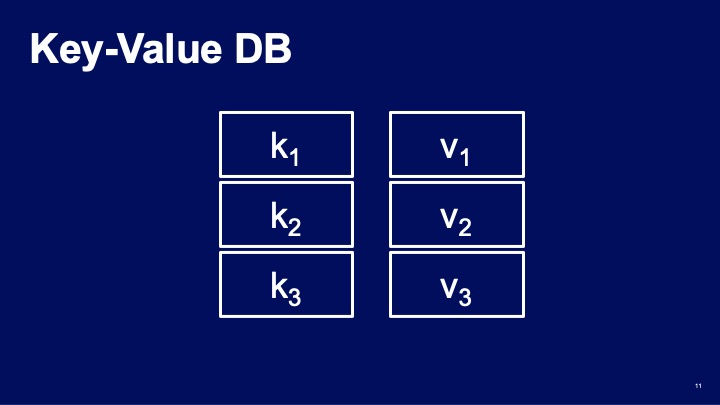

Given a query `k_q`, this query is first replicated and then compared with
every key `k_i` in the database. The result of this comparison should produce
an encrypted mask where an encryption of 0 will represent a non-matching entry
and an encryption of 1 will represent a matching entry. Since this database is
considered to have unique keys, a maximum of one match should ever be produced
per query.

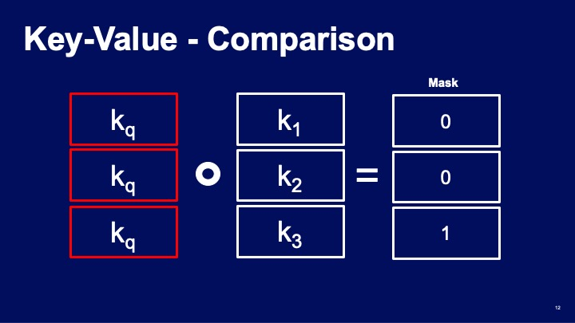

Given a mask of 0s and 1s, the mask can be multiplied across the values of the
database entry-wise. This process extracts the value corresponding to the key
that matched with the query. This is because a 0 multiplied with a value zeroes
out the value and a 1 multiplied with a value results in the value itself.

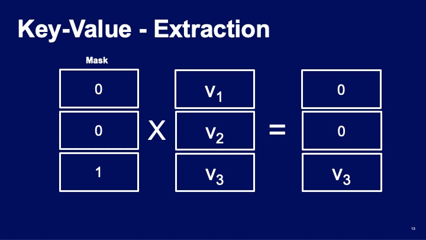

The first step of the algorithm is to compute the difference operation between
the query and the keys of the database. This is a simple subtraction operation
which performs an entry-wise subtraction operation of the array-like structure.
This will product a difference ciphertext which we denote as `delta`. Currently
`delta` will either be `0` if the key matched the query and non-zero otherwise. 
This is not quite the mask we require so we must perform another operation
described next.

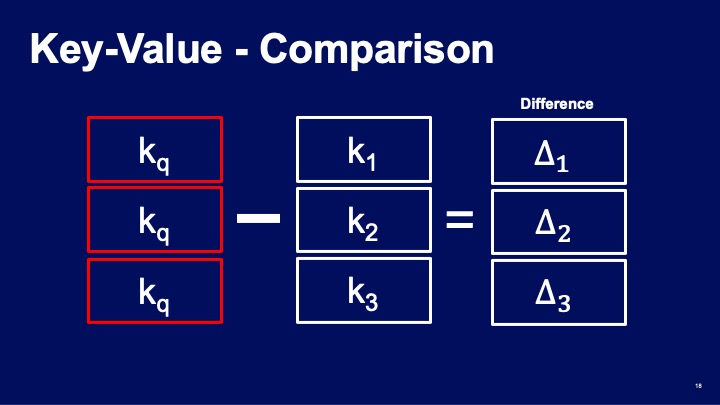

For the next step, one should be aware of a mathematical result known as
Fermat's little theorem (FLT). FLT states that given any non-zero integer `a`
and a prime number `p` then `a` raised to the power `p-1` always results in a
number `pn + 1` where `n` is an integer. This is formally captured below. Using
this result we can modify it slightly to produce a function `f(x)` as stated
below.

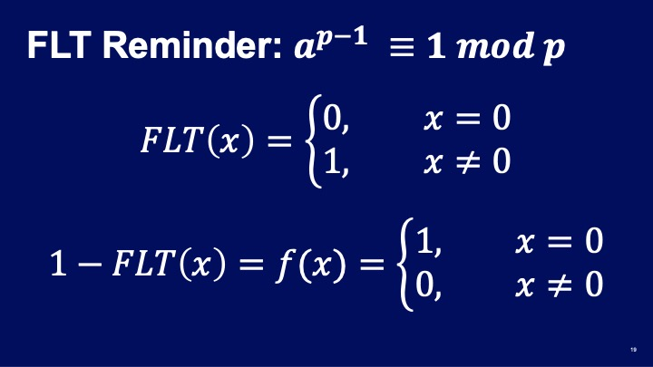

Given our function `f(x)` we can apply it to the previously calculated
differences and is captured in the two following images. First we apply the FLT
operation to every difference ciphertext. This produces an encryption of zero,
`E(0)`, if the difference was zero, i.e. there was a match and an encryption of
one, `E(1)`, otherwise.

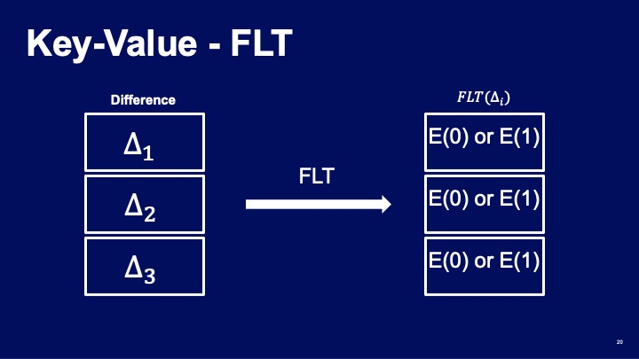

Next we use the previously calculated results of the FLT operation and minus
this value from `1`. This value of `1` can be in the clear as any operation
between a ciphertext and a plaintext results in a ciphertext. This has the
affect of mapping any non-zero value to zero and zero to one. Thus we obtain
the masks that we require from the comparison algorithm. Consider the 3rd entry
of the database matched the query then applying `f(x)` to the differences would
produce the results as shown below.

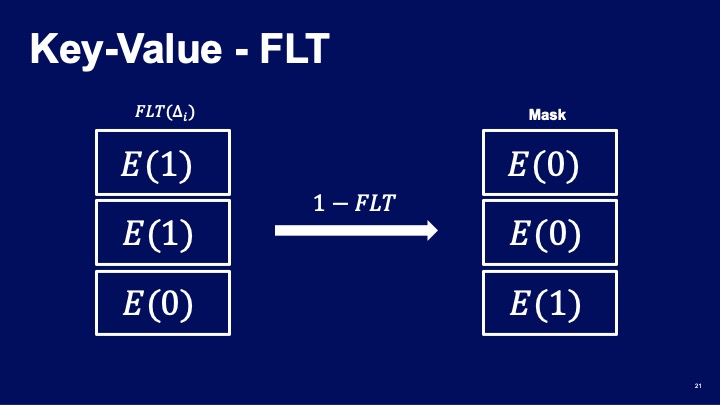

There is however another aspect to take into consideration, namely how do we
deal with partial matches? Consider the following scenario captured in the
image below. Imagine that the key matched only the second letter of the query
and maybe some of the padding values then it would produce an array like below.

Since we are only interested in exact matches for our lookup example, this
result should be considered as non-matching. To eliminate partially matching
results we simply copy the ciphertext, perform a rotation of our array like
structure of the copy and multiply it entry-wise with the original copy. This
means if there is at least one `0` in any of the slots of the ciphertext, this
slot will effectively `zero out` every other slot of the array.

Note that since we cannot know which ciphertext contains a matching, partially
matching, or non-matching result, this operation is also performed on the
matching result. However, since the ciphertext should have a `1` in every slot,
then this operation should have no effect.

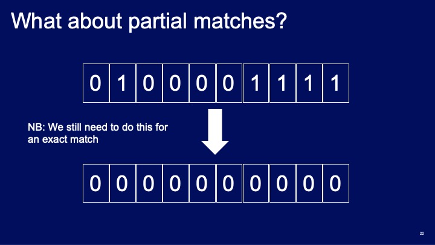

Now that we have our final masks, we can perform the data extraction from the
database. This step involves multiplying the mask with the respective value
entry of the database. Since our mask is an encryption of `0` if there is no
match, multiplying it with the corresponding entry will zero out that entry.
Additionally, since the mask is an encryption of `1` if there is a match,
multiplying it with the entry will return the entry itself. This can be seen
below, where the 3rd database entry matched the query.

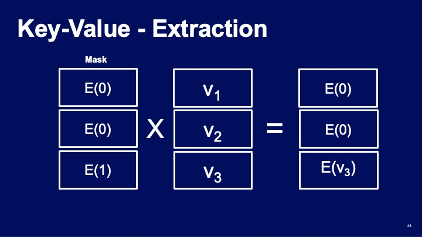

Since the keys in our example database are known to be unique, it can be
assured that there will only be a maximum of a single unique match per query.
Using this knowledge it is possible to aggregate all of the results from the
value extraction step into a single ciphertext. This is because adding
encryptions of `0` to a value does not change the value itself. This saves on
communication as the server only needs to send a single ciphertext back to the
client as opposed to a single ciphertext for each entry of the database.

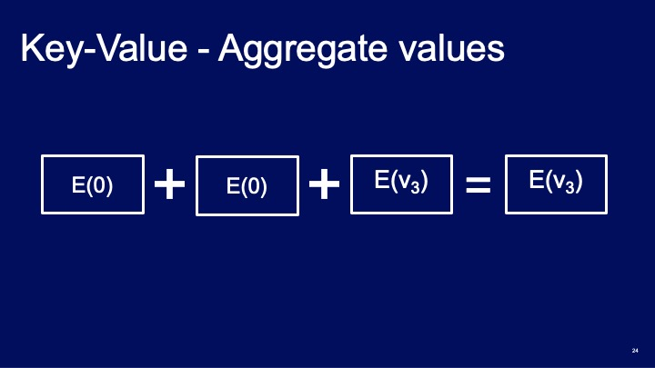

Having described the general concept of a database lookup using HE, let us
apply this to a concrete example, namely the country lookup implemented here.
Given a key-value store as described previously, let the set of keys be the
names of European countries and the let the values be the corresponding capital
cities as shown below.

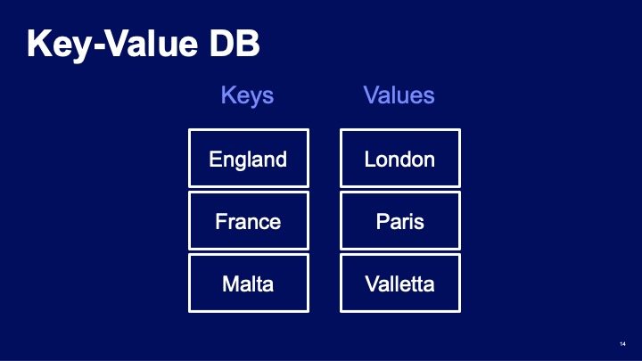

Intuitively, one can view the plaintext as an array-like structure with integer
coefficients held in the 'slots'. Since the BGV scheme represents data as
integer polynomials, the first step is to encode the data. We simply use ASCII
representation, thus encoding for example `France` as `70 114 97 110 99 101` as
shown below with padding of additional unused `slots` with `0`. Note that the
data determines the algebra to be used for the scheme. Since the largest ASCII
character is `126`, then we pick a prime number `p = 131` as our plaintext
prime modulus.

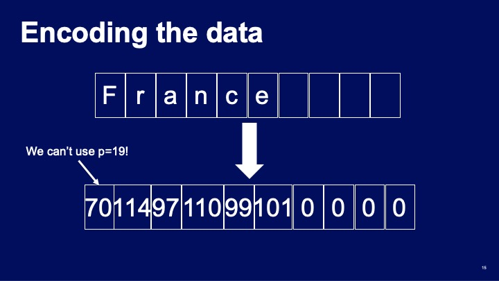

After encoding both the key and value data of the database, they can now be 
encrypted using a previously generated public key. We represent encrypted data
as `E()` where `E(England)` represents the ciphertext holding the encryption of
`England` in the image shown below.

The query country will also be encoded and encrypted in the same manner as the
database.

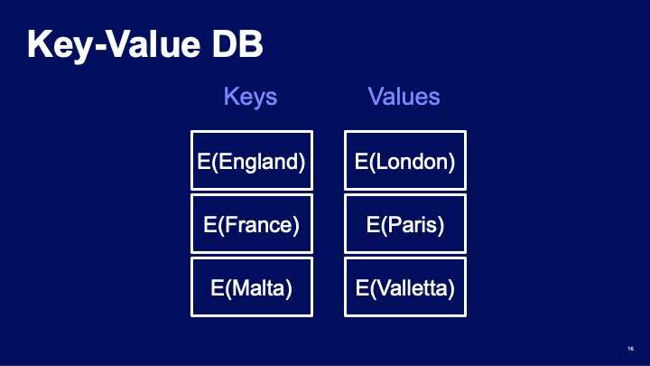

Now that the database is encrypted. Given an encrypted query `k_q` encrypted
under the same public key as the database, this query is first replicated to
create as many copies as there are entries in the database. Then we begin 
computing the comparison algorithm as stated before to produce a mask. In this
specific example, assume we would like to know the capital of `Malta`, then the
homomorphic comparison should look something like below. Where the comparison
of the query with the database key for `Malta` produces the mask `E(1)` and all
other entries of the database produce `E(0)`.

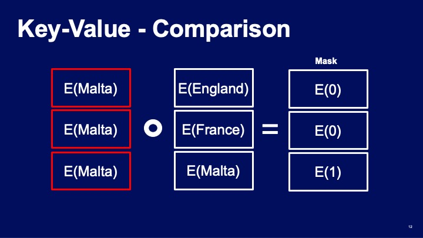

Now that we have the mask, we use this mask to extract the corresponding value
from the database. As shown below, this operation should produce encryptions
of zero, `E(0)`, for all non-matching entries and an encryption of the capital
city of the country we queried, which will be an encryption of `Valletta`.

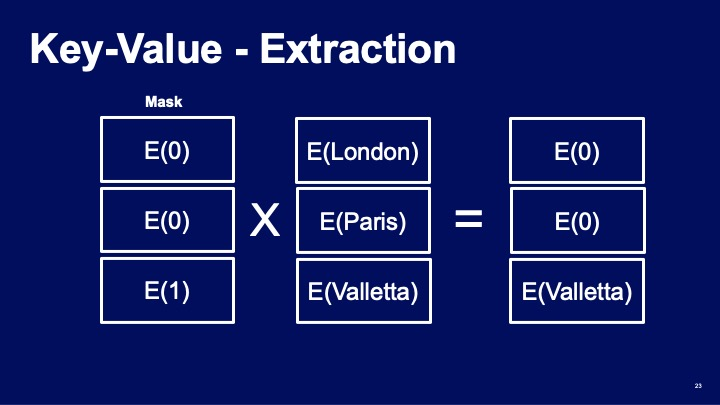

Using the aggregation technique described previously, the server can combine
the results of the previous step and send back a single ciphertext, in this
case the encryption of the capital of `Malta` which is `Valletta`. The client
receives this ciphertext and can decrypt it using the secret key and view the
result of their query.

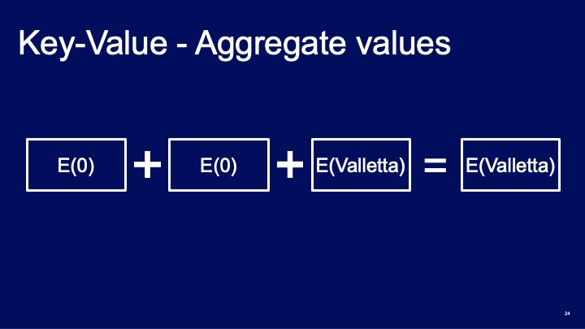

This concludes the description of the database lookup algorithm. For more
information on how this was implemented using HElib, please look through the
provided source code [here](BGV_country_db_lookup.cpp).

## Run and Validate
Depending on the toolkit you are using, select or type in a *European* Country
name. For example Sweden, Germany, Czech Republic. For countries in the United
Kingdom, use one of: England, Scotland, Wales and Northern Ireland.

Please note: there is no fuzzy matching, the spelling of the country name has
to be exact.

## Acknowledgment
This country lookup example is derived from an earlier BGV database demo code
originally written by Jack Crawford for a lunch and learn session at IBM
Research (Hursley) in 2019. The original demo code ships with HElib and can be
found
[here](https://github.com/homenc/HElib/tree/v1.0.2/examples/BGV_database_lookup).

## Appendix - Full List of Countries
To view the options available for this demo, see the
[dataset](countries_dataset.csv).

  [1]: http://eprint.iacr.org/2011/277       "BGV12"
